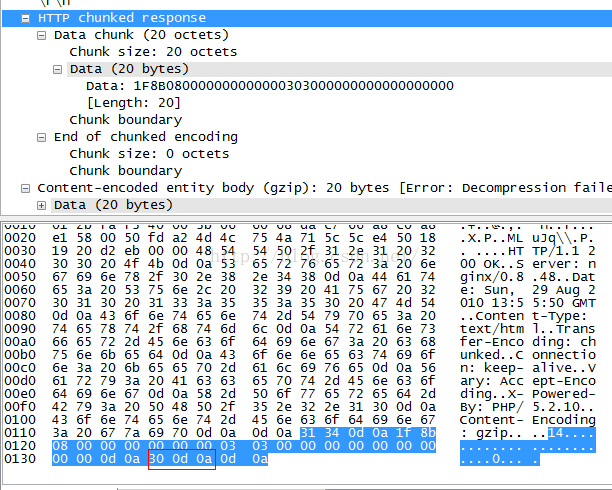

HTTP协议：不可小觑的Content-Length
关于攻击

Content-Length首部告诉浏览器报文中实体主体的大小。这个大小是包含了内容编码的，比如对文件进行了gzip压缩，Content-Length就是压缩后的大小（这点对我们编写服务器非常重要）。除非使用了分块编码，否则Content-Length首部就是带有实体主体的报文必须使用的。使用Content-Length首部是为了能够检测出服务器崩溃而导致的报文截尾，并对共享持久连接的多个报文进行正确分段。

1）检测截尾

HTTP的早期版本采用关闭连接的办法来划定报文的结束。但是，没有Content-Length的话，客户端无法区分到底是报文结束时正常的关闭连接还是报文传输中由于服务器崩溃而导致的连接关闭。客户端需要通过Content-Length来检测报文截尾。

报文截尾的问题对缓存代理服务器来说尤为重要。如果缓存服务器收到被截尾的报文却没有识别出截尾的话，它可能会存储不完整的内容并多次使用他来提供服务。缓存代理服务器通常不会为没有显式Content-Length首部的HTTP主体做缓存，以此来减小缓存已截尾报文的风险。

2）Content-Length与持久连接

Content-Length首部对于持久链接是必不可少的。如果响应通过持久连接传送，就可能有另一条HTTP响应紧随其后。客户端通过Content-Length首部就可以知道报文在何处结束，下一条报文从何处开始。因为连接是持久的，客户端无法依赖连接关闭来判断报文的结束。

有一种情况，使用持久连接可以没有Content-Length首部，即采用分块编码（chunked encoding）时。在分块编码的情况下，数据是分为一系列的块来发送的，没块都有大小说明。哪怕服务器在生成首部的时候不知道整个实体的大小（通常是因为实体是动态生成的），仍然可以使用分块编码传输若干已知大小的块。

1.当客户端请求时是Connection: keep-alive的时候，服务器返回的形式Transfer-Encoding: chunked的形式，以确保页面数据是否结束，长连接就是这种方式，用chunked形式就不能用content-length
参考：
设置响应消息的实体内容的大小，单位为字节。对于HTTP协议来说，这个方法就是设置 Content-Length响应头字段的值。因为当浏览器与WEB服务器之间使用持久(keep-alive)的HTTP连接，如果WEB服务器没有采用chunked传输编码方式，那么它必须在每一个应答中发送一个 Content-Length的响应头来表示各个实体内容的长度，以便客户端能够分辨出上一个响应内容的结束位置。一般来说，Servlet程序不必调用 setContentLength方法来设置Content-Length头字段，因为Servlet引擎在向客户端实际输出响应内容时，它可以自动设置 Content-Length头字段或采用chunked传输编码方式。
http://hi.baidu.com/zkheartboy/blog/item/9216a0fd05591e1508244d74.html
2.当不是keep-alive，就是常用短连接形式，会直接把连接关掉，不需要长度
3. 服务器上取得是动态内容，所有没有content-length这项
如果是静态页面，则有
HTTP/1.0 的持久连接机制是后来才引入的，通过 Connection: keep-alive 这个头部来实现，服务端和客户端都可以使用它告诉对方在发送完数据之后不需要断开 TCP 连接，以备后用。HTTP/1.1 则规定所有连接都必须是持久的，除非显式地在头部加上 Connection: close。所以实际上，HTTP/1.1 中 Connection 这个头部字段已经没有 keep-alive 这个取值了，但由于历史原因，很多 Web Server 和浏览器，还是保留着给 HTTP/1.1 长连接发送 Connection: keep-alive 的习惯。
HTTP 协议中的 Transfer-Encoding
对于持久连接, 不光服务器需要定义实体边界, 浏览器也需要.
我们在做 WEB 性能优化时，有一个重要的指标叫 TTFB（Time To First Byte），它代表的是从客户端发出请求到收到响应的第一个字节所花费的时间。大部分浏览器自带的 Network 面板都可以看到这个指标，越短的 TTFB 意味着用户可以越早看到页面内容，体验越好。可想而知，服务端为了计算响应实体长度而缓存所有内容，跟更短的 TTFB 理念背道而驰。但在 HTTP 报文中，实体一定要在头部之后，顺序不能颠倒，为此我们需要一个新的机制：不依赖头部的长度信息，也能知道实体的边界.
Transfer-Encoding: chunked本文主角终于再次出现了，Transfer-Encoding 正是用来解决上面这个问题的。历史上 Transfer-Encoding 可以有多种取值，为此还引入了一个名为 TE 的头部用来协商采用何种传输编码。但是最新的 HTTP 规范里，只定义了一种传输编码：分块编码（chunked）。
分块编码相当简单，在头部加入 Transfer-Encoding: chunked 之后，就代表这个报文采用了分块编码。这时，报文中的实体需要改为用一系列分块来传输。每个分块包含十六进制的长度值和数据，长度值独占一行，长度不包括它结尾的 CRLF（\r\n），也不包括分块数据结尾的 CRLF。最后一个分块长度值必须为 0，对应的分块数据没有内容，表示实体结束。按照这个格式改造下之前的代码：
JSrequire('net').createServer(function(sock) {
    sock.on('data', function(data) {
        sock.write('HTTP/1.1 200 OK\r\n');
        sock.write('Transfer-Encoding: chunked\r\n');
        sock.write('\r\n');

        sock.write('b\r\n');
        sock.write('01234567890\r\n');

        sock.write('5\r\n');
        sock.write('12345\r\n');

        sock.write('0\r\n');
        sock.write('\r\n');
    });
}).listen(9090, '127.0.0.1');
上面这个例子中，我在响应头中表明接下来的实体会采用分块编码，然后输出了 11 字节的分块，接着又输出了 5 字节的分块，最后用一个 0 长度的分块表明数据已经传完了。用浏览器访问这个服务，可以得到正确结果。可以看到，通过这种简单的分块策略，很好的解决了前面提出的问题。
前面说过 Content-Encoding 和 Transfer-Encoding 二者经常会结合来用，其实就是针对 Transfer-Encoding 的分块再进行 Content-Encoding。下面是我用 telnet 请求测试页面得到的响应，就对分块内容进行了 gzip 编码：
BASH> telnet 106.187.88.156 80

GET /test.php HTTP/1.1
Host: qgy18.qgy18.com
Accept-Encoding: gzip

HTTP/1.1 200 OK
Server: nginx
Date: Sun, 03 May 2015 17:25:23 GMT
Content-Type: text/html
Transfer-Encoding: chunked
Connection: keep-alive
Content-Encoding: gzip

用 HTTP 抓包神器 Fiddler 也可以看到类似结果，有兴趣的同学可以自己试一下。
其中Transfer-Encoding:chunked表示内容长度在后面介绍，b这个16进制数字就表示长度为11，然后是内容 
(helloworld!)，然后以\r\n结束，如果有下一段，则一个16进制数字表示长度，直到最后一段没有了，才以0 
结束。 
不过不用担心，在浏览器里会自动解释分析，不会让你看到b,3,0，就算在firebug里也显示的是helloworld! 
123。 

HTTP 协议中的 Content-Encoding
---
先进行Content-Encoding 再进行Transfer-Encoding: chunked
transfer-encoding:chunked的含义 看这篇文章 http://blog.csdn.net/whatday/article/details/7571451
数据---content-encoding--变成十六进制码
在上述码中,插入ascii的chunck数据,
Chunked编码使用若干个Chunk串连而成，由一个标明长度为0的chunk标示结束。每个Chunk分为头部和正文两部分，头部内容指定下一段正文的字符总数（十六进制的数字）和数量单位（一般不写），正文部分就是指定长度的实际内容，两部分之间用回车换行(CRLF)隔开。在最后一个长度为0的Chunk中的内容是称为footer的内容，是一些附加的Header信息（通常可以直接忽略）。

这里面只有一个有意义的chunke以及一个footer。第一个chunk，头部是3134这两个字节，表示的是1和4这两个ascii字符，被http协议解释为十六进制数14，也就是十进制的20(ascii表示的十六进制数字)。后面紧跟0d0a(回车换行)，再接着是20个字节的chunk正文（图中的011e~0131）。

后面再接着0d0a，然后就是footer了，30表示ascii字符0，http解释为长度是0（也说明了这是最后一个chunk），后面紧跟0d0a，然后正文部分为空，再接0d 0a表示结束.

